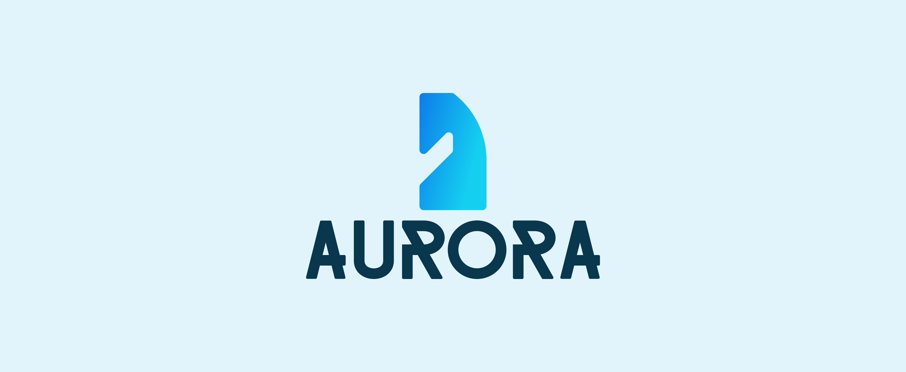

# 

	
	
  

Aurora is an open-source chess engine being developed by Shambu Kumar in C++. 

## Goals :dart:

- **Chess Engine**: Aurora aims to be a powerful and competitive chess engine capable of playing chess games against human players or other chess engines.
- **Open Source**: The project is open-source, fostering collaboration and allowing developers to contribute, modify, and enhance the engine.
- **Standard Chess**: Aurora will support standard chess rules, including castling, en passant captures, pawn promotion, and check/checkmate detection.
- **Efficient Algorithms**: The engine will utilize efficient algorithms, such as alpha-beta pruning, to improve search efficiency and make intelligent move decisions.
- **User Interface**: Aurora will include its own user interface (UI) to provide a seamless and user-friendly chess-playing experience. :desktop_computer:

## Development Status :construction:

Please note that the Aurora Chess Engine project is currently a work in progress and not ready for production use. Development is ongoing, and the engine is not yet fully functional.

## Contribution :raised_hands:

Contributions to the Aurora Chess Engine project are welcome once it reaches a more stable state. If you're interested in contributing, please keep an eye on the repository for future updates and announcements.

## License :page_with_curl:

The project is under the MIT license

## Contact :email:

For any questions or inquiries about the Aurora Chess Engine project, please reach out to me at kumarshambu2010@gmail.com.

Thank you for your interest in Aurora Chess Engine. Stay tuned for future updates! :rocket:

## Begin worked on right now...

### Legal move generation:
	- Pinned pieces
	- Not moving into check
### Move tree:
	-Move search and position storing
### Special moves and rules
	-En passant
	-Castling
	-Draws
	-Castling rights
## Note
If you want to follow what is being worked on exactly at the moment, feel free to check out the commits section!

